# Digital Music Store Analysis

This repository contains SQL queries and analysis for understanding the transactional data of a digital music store. The queries address specific business questions and provide actionable insights for management, marketing, and product teams. Screenshots of query results are included for easy reference.

## Repository Structure

Each task is organized into a separate section with:
- The SQL query
- A description of the task and results
- A screenshot of the query result, saved in the `Image/` folder of this repository

## ERD Diagram
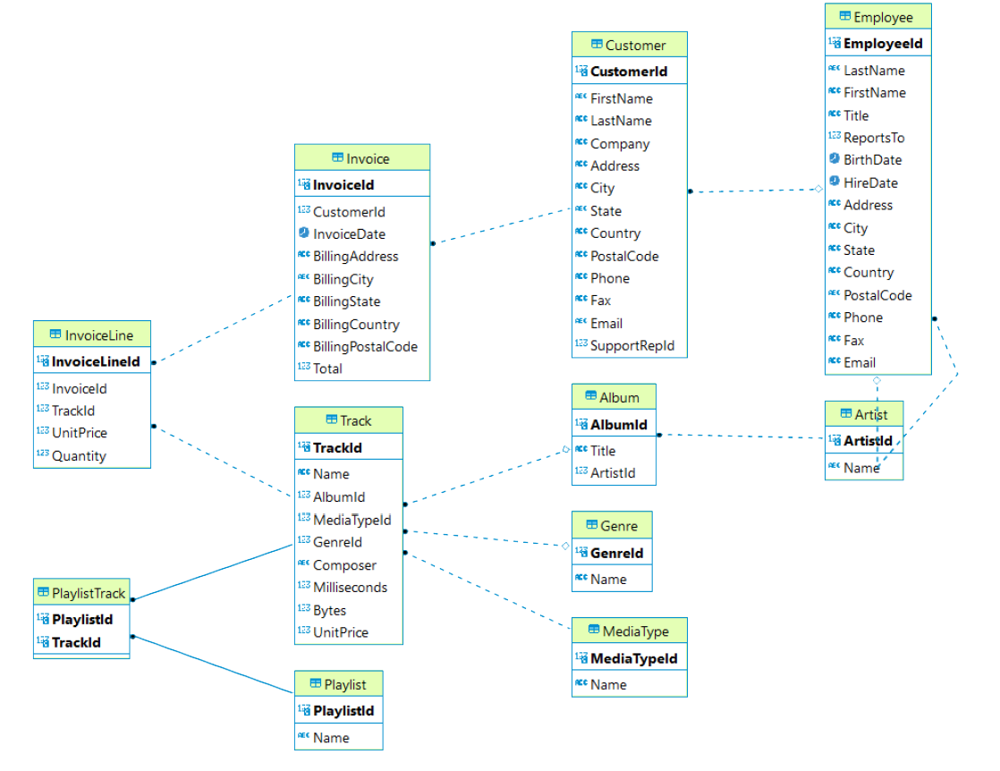

### Tasks

1. **Top Countries by Invoice Count**  
   Find the top 10 countries with the highest number of invoices. Results are sorted by invoice count and country name.

   - **SQL Query**:
     ```sql
     SELECT
         "BillingCountry" AS country,
         COUNT("InvoiceId") AS total_invoices
     FROM
         "Invoice"
     GROUP BY
         "BillingCountry"
     ORDER BY
         total_invoices DESC, country ASC
     LIMIT 10;
     ```
   - **Screenshot**:  
     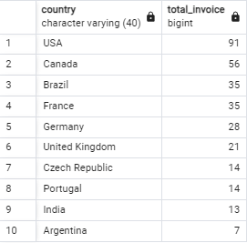

2. **Top Genres by Sales**  
   Identify the top 10 music genres by total sales, calculated as the product of quantity sold and unit price.

   - **SQL Query**:
     ```sql
     SELECT
         g."Name" AS genre,
         SUM(il."Quantity" * il."UnitPrice") AS total_sales
     FROM
         "Invoice" i
         JOIN "InvoiceLine" il USING ("InvoiceId")
         JOIN "Track" t USING ("TrackId")
         JOIN "Genre" g USING ("GenreId")
     WHERE
         i."BillingCountry" IN ('USA')
     GROUP BY 
         g."Name"
     ORDER BY 
         total_sales DESC
     LIMIT 10;
     ```
   - **Screenshot**:  
     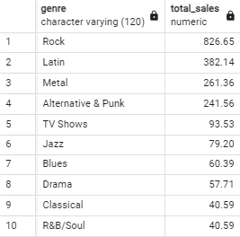

3. **Top Customers by Spending**  
   Find the top 10 customers based on their total spending, including customer names, emails, and total amounts.

   - **SQL Query**:
     ```sql
     SELECT
         CONCAT(c."FirstName", ' ', c."LastName") AS full_name,
         c."Email" AS email,
         SUM(i."Total") AS total_spending
     FROM
         "Customer" c
         JOIN "Invoice" i USING ("CustomerId")
     GROUP BY
         c."CustomerId"
     ORDER BY
         total_spending DESC
     LIMIT 10;
     ```
   - **Screenshot**:  
     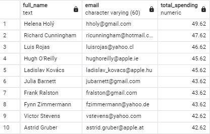

4. **Top Cities by Invoice Count in Top Countries**  
   Find the city with the most invoices for each of the top countries identified in Task 1.

   - **SQL Query**:
     ```sql
     WITH CityInvoiceCounts AS (
         SELECT
             "BillingCountry" AS country,
             "BillingCity" AS city,
             COUNT("InvoiceId") AS total_invoices,
             ROW_NUMBER() OVER (PARTITION BY "BillingCountry" ORDER BY COUNT("InvoiceId") DESC) AS rank
         FROM 
             "Invoice"
         WHERE 
             "BillingCountry" IN (SELECT country FROM TopCountryByInvoice)
         GROUP BY 
             "BillingCountry", "BillingCity"
     )
     SELECT
         country,
         city,
         total_invoices
     FROM 
         CityInvoiceCounts
     WHERE 
         rank = 1
     ORDER BY 
         total_invoices DESC, country;
     ```
   - **Screenshot**:  
     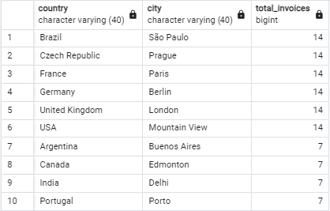

5. **Top Genres in the UK for New Track Selection**  
   Help the product team select 4 out of 6 tracks based on the popularity of their genres in the UK.

   - **SQL Query**:
     ```sql
     WITH PopularGenreUK AS (
         SELECT
             g."Name" AS genre,
             SUM(il."Quantity") AS num_sold,
             ROW_NUMBER() OVER (ORDER BY SUM(il."Quantity") DESC) AS rank_num
         FROM
             "Invoice" i
             JOIN "InvoiceLine" il USING ("InvoiceId")
             JOIN "Track" t USING ("TrackId")
             JOIN "Genre" g USING ("GenreId")
         WHERE
             i."BillingCountry" = 'United Kingdom'
         GROUP BY
             g."Name"
     )
     SELECT 
         song,
         s.genre
     FROM (
         VALUES
             ('Lalaland', 'R&B/Soul'),
             ('Soul Sister', 'Pop'),
             ('Good to See You', 'Rock'),
             ('Nothing On You', 'Jazz'),
             ('Get Ya Before Sunrise', 'Reggae'),
             ('Before The Coffee Gets Cold', 'Hip Hop/Rap')
     ) AS s (song, genre)
     JOIN PopularGenreUK p USING(genre)
     ORDER BY
         rank_num
     LIMIT 4;
     ```
   - **Screenshot**:  
     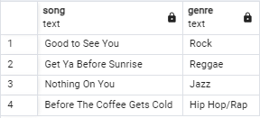

6. **Popular Albums in the USA**  
   Identify the top 10 most popular albums in the USA based on album units sold.

   - **SQL Query**:
     ```sql
     SELECT
         a."Title" AS album_name,
         SUM(il."Quantity") AS num_sold
     FROM
         "Invoice" i
         JOIN "InvoiceLine" il USING ("InvoiceId")
         JOIN "Track" t USING ("TrackId")
         JOIN "Album" a USING ("AlbumId")
     WHERE
         i."BillingCountry" = 'USA'
     GROUP BY
         a."Title"
     ORDER BY
         num_sold DESC
     LIMIT 10;
     ```
   - **Screenshot**:  
     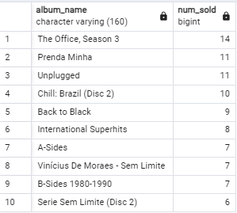

7. **Aggregated Purchase Data by Country**  
   Provide a table aggregating purchase data by country. Countries with only one customer are grouped as 'Others,' with metrics like total customers, total sales, average sales per customer, and average order value.

   - **SQL Query**:
     ```sql
     WITH CountryCustomerCounts AS (
         SELECT
             "Country",
             COUNT("CustomerId") AS customer_count
         FROM
             "Customer"
         GROUP BY
             "Country"
     )
     SELECT
         CASE
             WHEN ccc.customer_count = 1 THEN 'Others'
             ELSE c."Country"
         END AS country,
         COUNT(DISTINCT c."CustomerId") AS total_customers,
         SUM(i."Total") AS total_sales,
         COUNT(i."InvoiceId") AS total_orders,
         ROUND(SUM(i."Total") / COUNT(DISTINCT c."CustomerId"), 2) AS avg_sales_per_customer,
         ROUND(SUM(i."Total") / COUNT(i."InvoiceId"), 2) AS avg_order_value
     FROM
         "Customer" c
         LEFT JOIN "Invoice" i USING ("CustomerId")
         JOIN CountryCustomerCounts ccc ON c."Country" = ccc."Country"
     GROUP BY
         CASE
             WHEN ccc.customer_count = 1 THEN 'Others'
             ELSE c."Country"
         END
     ORDER BY
         total_sales DESC;
     ```
   - **Screenshot**:  
     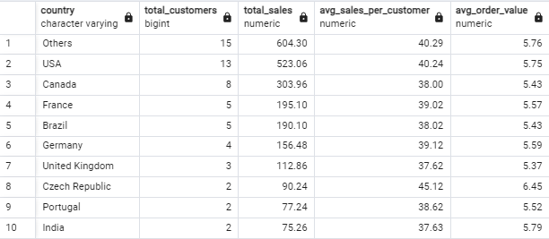

8. **Low-Selling Genres in the USA**  
   Identify genres with low sales in the USA for potential promotional strategies. Sales are calculated as the product of quantity sold and unit price.

   - **SQL Query**:
     ```sql
     SELECT
         g."Name" AS genre,
         SUM(il."Quantity" * il."UnitPrice") AS total_sales
     FROM
         "Invoice" i
         JOIN "InvoiceLine" il USING ("InvoiceId")
         JOIN "Track" t USING ("TrackId")
         JOIN "Genre" g USING ("GenreId")
     WHERE
         i."BillingCountry" = 'USA'
     GROUP BY 
         g."Name"
     ORDER BY 
         total_sales ASC
     LIMIT 10;
     ```
   - **Screenshot**:  
     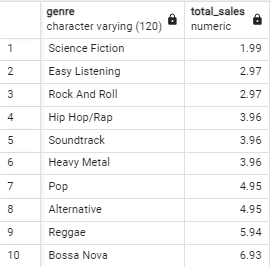

9. **Top Genres for Each Customer**  
   Identify the top genre for each customer based on their spending to personalize song recommendations.

   - **SQL Query**:
     ```sql
     WITH CustomerGenreSales AS (
         SELECT 
             CONCAT(c."FirstName", ' ', c."LastName") AS full_name,
             g."Name" AS genre,
             SUM(il."Quantity" * il."UnitPrice") AS total_sales
         FROM
             "Customer" c
             JOIN "Invoice" i USING ("CustomerId")
             JOIN "InvoiceLine" il USING ("InvoiceId")
             JOIN "Track" t USING ("TrackId")
             JOIN "Genre" g USING ("GenreId")
         GROUP BY 
             full_name, genre
     ),
     CustomerGenreRanked AS (
         SELECT
             full_name,
             genre,
             total_sales,
             ROW_NUMBER() OVER (PARTITION BY full_name ORDER BY total_sales DESC) AS rank
         FROM
             CustomerGenreSales
     )
     SELECT
         full_name,
         genre,
         total_sales
     FROM
         CustomerGenreRanked
     WHERE
         rank = 1
     ORDER BY
         total_sales DESC;
     ```
   - **Screenshot**:  
     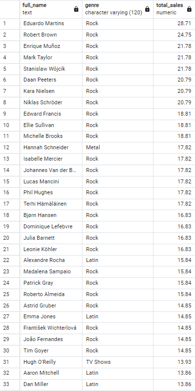

10. **Top-Spending Countries**  
    Identify the top 10 countries with customers who spent the most money.

    - **SQL Query**:
      ```sql
      SELECT
          i."BillingCountry" AS country,
          SUM(i."Total") AS total_spending
      FROM 
          "Customer" c
          JOIN "Invoice" i USING ("CustomerId")
      GROUP BY
          i."BillingCountry"
      ORDER BY
          total_spending DESC
      LIMIT 10;
      ```
    - **Screenshot**:  
      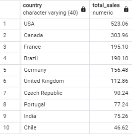

---

## How to Use

1. Each task is documented with:
   - SQL query
   - Screenshot of the query result (stored in the `Image/` folder)
   - Description of the task and its output
     
2. Use the SQL scripts with a PostgreSQL database to replicate the results.

---

## Requirements

- PostgreSQL database
- Dataset including tables like `Invoice`, `Customer`, `Genre`, `Track`, `InvoiceLine`, etc.

---

## Acknowledgments

- Dataset provided as part of the Mentoring Program - SQL & Relational Database by Pacmann AI.
